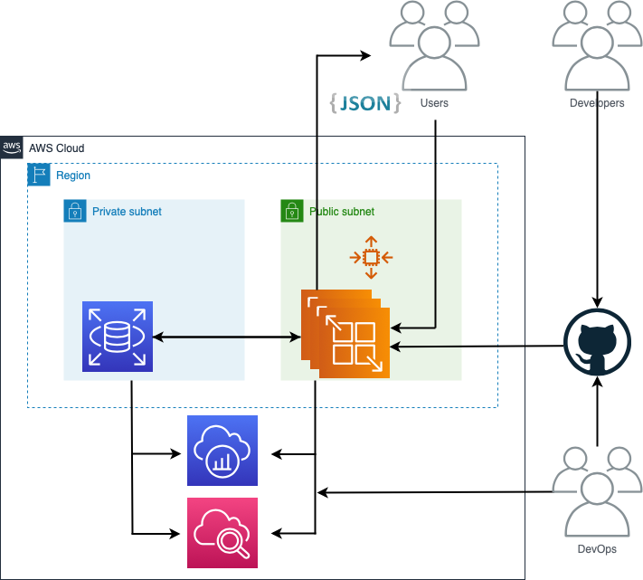

# technical_test_2
## Configure backed s3 for terraform

## Solution Architecture


### Prerequisites
Before running the CI/CD pipeline to deploy the infrastructure, you must satisfy the following prerequisites

### AWS account
Be sure to contract with an AWS account with the necessary permissions to create the infrastructure, *administrator permissions*, for a productive account, I recommend that you limit the permissions to a minimum with only those necessary to operate this pipeline.

## Install or Upgrade [awscli](https://docs.aws.amazon.com/cli/latest/userguide/getting-started-install.html)

To ensure you are running the latest version of AWS CLI, run the following command:
```bash
$ curl -s "https://awscli.amazonaws.com/AWSCLIV2.pkg" -o "AWSCLIV2.pkg"
$ sudo installer -pkg ./AWSCLIV2.pkg -target /
```
**Note:** go to the amazon website, [getting-started-install section](https://docs.aws.amazon.com/cli/latest/userguide/getting-started-install.html) if you want to use another installation or update method more suitable for your Operating System.

## Configuring the AWS CLI [access key](https://docs.aws.amazon.com/cli/latest/userguide/cli-chap-configure.html)
```bash
$ aws configure
$ AWS Access Key ID [None]: <AWS_ACCESS_KEY_ID>
$ AWS Secret Access Key [None]: <AWS_SECRET_ACCESS_KEY>
$ Default region name [None]: [us-east-1]
$ Default output format [None]:
```
## Install or Upgrade [Terraform](https://developer.hashicorp.com/terraform/tutorials/aws-get-started/install-cli)
```bash
$ brew tap hashicorp/tap
$ brew install hashicorp/tap/terraform
```

## Configuring terraform for centralized backend
You must create an S3 bucket and a table in dynamoDB
```sh
$ aws s3api create-bucket --region us-east-1 --bucket terraform-lwwjdattfsri2egsjecb2sdpufiusipyg15edkeoa4oe
$ aws s3api put-bucket-encryption --server-side-encryption-configuration '{"Rules": [{"ApplyServerSideEncryptionByDefault": {"SSEAlgorithm": "AES256"}}]}' --bucket terraform-lwwjdattfsri2egsjecb2sdpufiusipyg15edkeoa4oe
$ aws dynamodb create-table --table-name tfstate-locking --attribute-definitions AttributeName=LockID,AttributeType=S --key-schema AttributeName=LockID,KeyType=HASH --provisioned-throughput ReadCapacityUnits=5,WriteCapacityUnits=5
```
